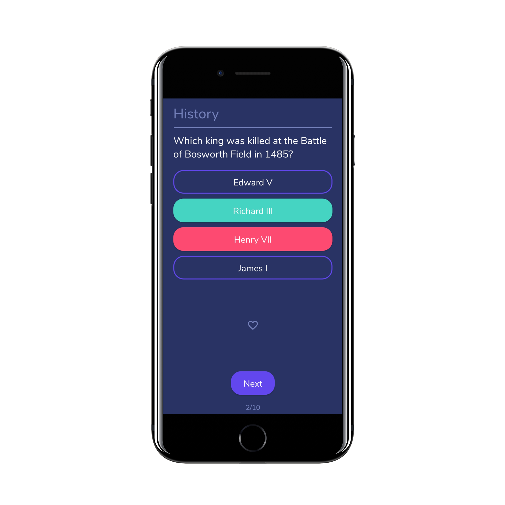
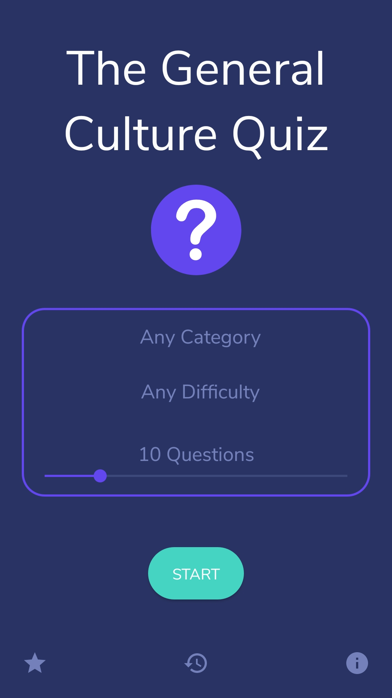
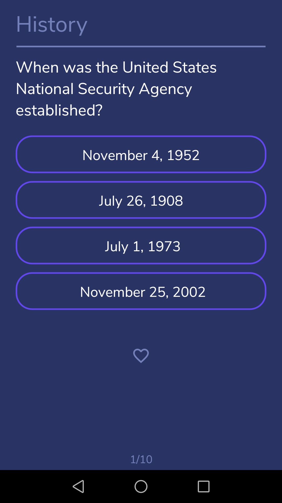
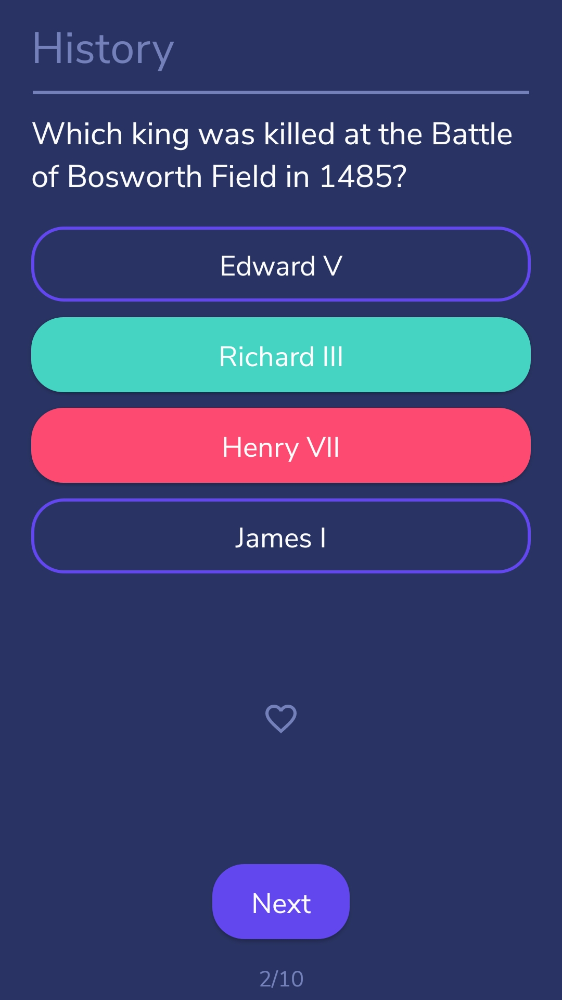
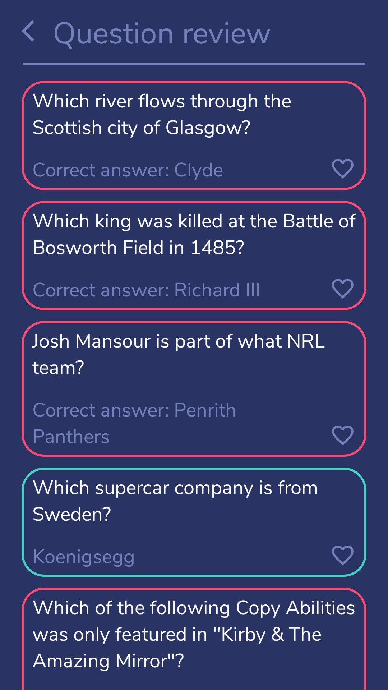
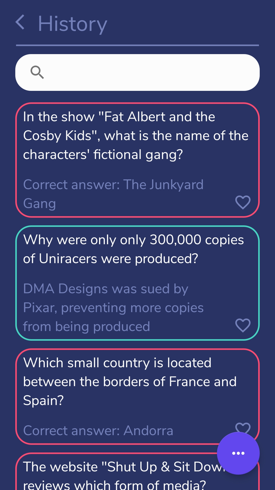
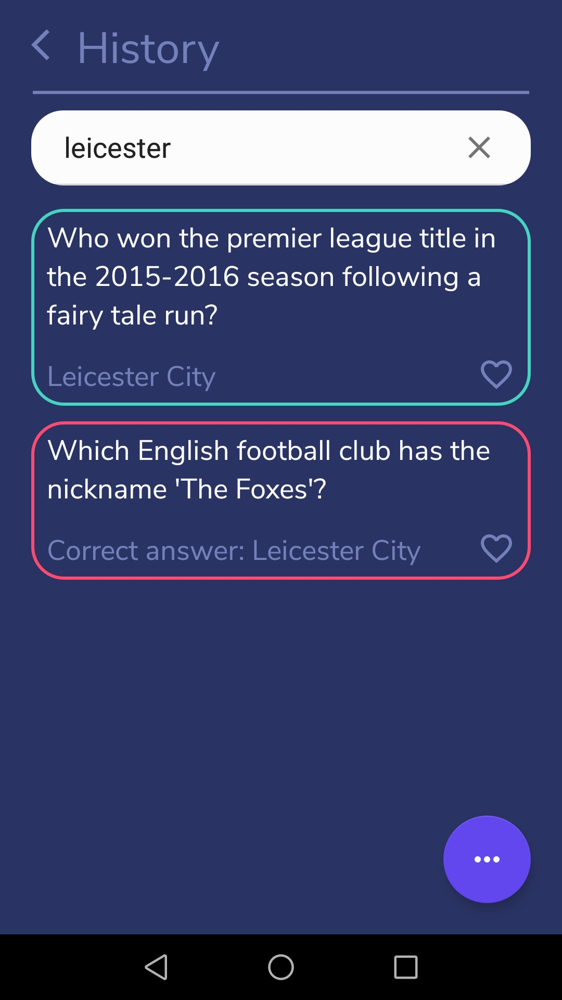

# The General Culture Quiz (Android App)

 
This application is a general culture quiz using [Open Trivia Database]. So I'm not responsible for the questions and answers.
I made this app only in order to have a game to pass the time in public transportation for example. 

It is a very simple game. You can choose between the following levels of difficulty:
-   Any Difficulty
-   East
-   Medium
-   Hard

Then, you can choose between one of the 25 following categories of questions:
-   Any Category
-   General Knowledge
-   Entertainment: Books
-   Entertainment: Film
-   Entertainment: Music
-   Entertainment: Musicals & Theatres
-   Entertainment: Television
-   Entertainment: Video Games
-   Entertainment: Board Games
-   Entertainment: Comics
-   Entertainment: Japanese Anime & Manga
-   Entertainment: Cartoon & Animations
-   Science & Nature
-   Science: Computers
-   Science: Mathematics
-   Science: Gadgets
-   Mythology
-   Sports
-   Geography
-   History
-   Politics
-   Celebrities
-   Art
-   Animals
-   Vehicles
    
And you can also choose the amount of questions (between 1 and 50).

You also have a history of all the questions you have answered. You can filter this list by categories, by correct answer, ...

## Screenshots

 

 

  
 

## To Do
-   Create the Success activity and all success
-   Add a Light Mode
-   Add support for True/False questions

## License
This project is licensed under the MIT License - see the [LICENSE] file for details.

## Contributing
Contributions are welcome :smile:

### Pull requests
Just a few guidelines:
-   Write clean code with appropriate comments and add suitable error handling.
-   Test the application and make sure no bugs/ issues come up.
-   Open a pull request and I will be happy to acknowledge your contribution after some checking from my side.

### Issues
If you find any bugs/issues, raise an issue.

  [LICENSE]: <LICENSE>
  [Open Trivia Database]: <https://opentdb.com/>