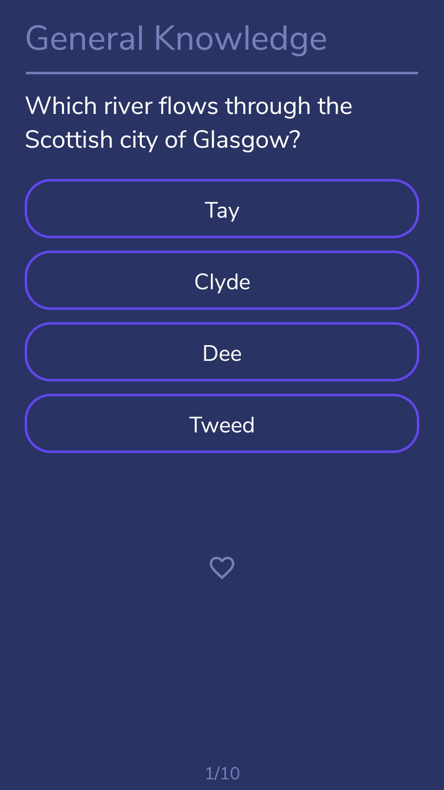
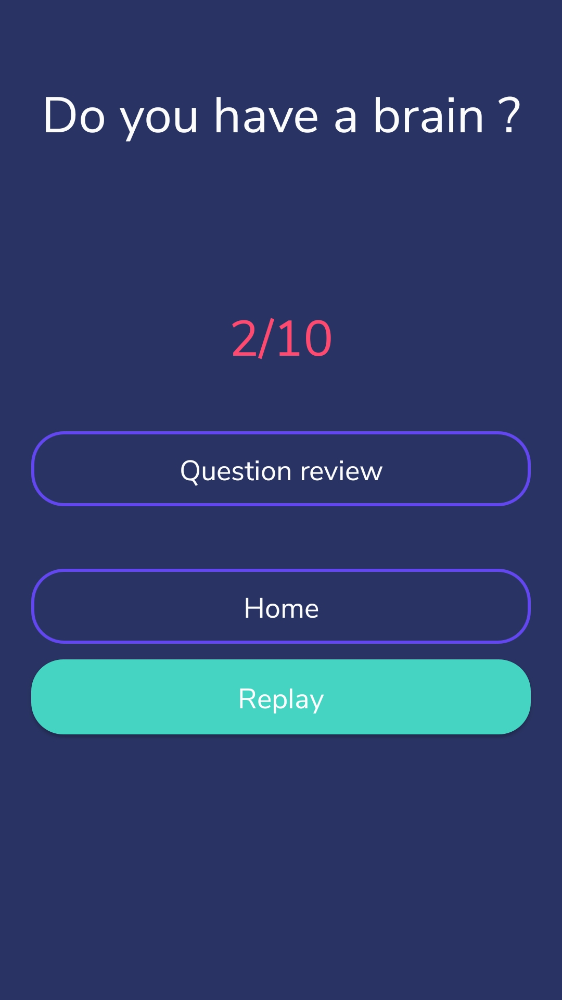

# The General Culture Quiz (Android App)

This application is a general culture quiz using [Open Trivia Database]. So I'm not responsible for the questions and answers.
I made this app only in order to have a game to pass the time in public transportation for example. 

It is a very simple game. You can choose between the following levels of difficulty:
  - Any Difficulty
  - East
  - Medium
  - Hard

Then, you can choose between one of the 25 following categories of questions:
  - Any Category
  - General Knowledge
  - Entertainment: Books
  - Entertainment: Film
  - Entertainment: Music
  - Entertainment: Musicals & Theatres
  - Entertainment: Television
  - Entertainment: Video Games
  - Entertainment: Board Games
  - Entertainment: Comics
  - Entertainment: Japanese Anime & Manga
  - Entertainment: Cartoon & Animations
  - Science & Nature
  - Science: Computers
  - Science: Mathematics
  - Science: Gadgets
  - Mythology
  - Sports
  - Geography
  - History
  - Politics
  - Celebrities
  - Art
  - Animals
  - Vehicles
    
And you can also choose the amount of questions (between 1 and 50).

You also have a history of all the questions you have answered. You can filter this list by categories, by correct answer, ...

## Screenshots
 

 
 

  

 

## To Do
  - Create the Success activity and all success
  - Add a Light Mode
  - Add support for True/False questions

## License
This project is licensed under the MIT License - see the [LICENSE] file for details.

  [LICENSE]: <LICENSE>
  [Open Trivia Database]: <https://opentdb.com/>